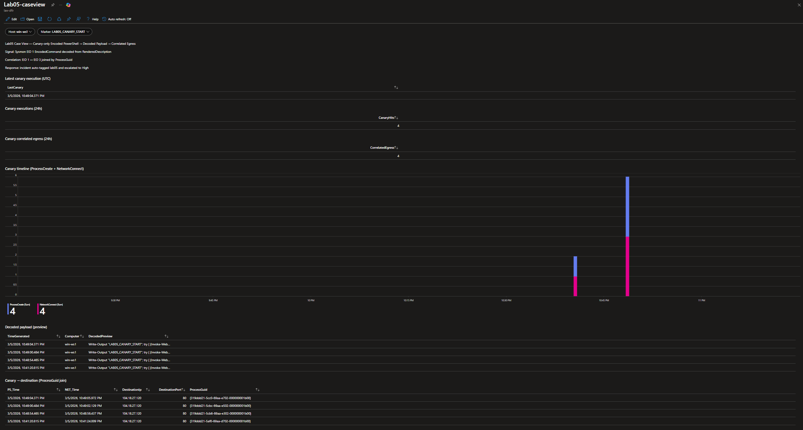

# 05 — Memory Forensics + Cloud SecOps Loop (Microsoft Sentinel)

**Quick links:** [What this lab demonstrates](#what-this-lab-demonstrates) · [The pivot](#the-pivot-constraints--decision) · [Memory-backed proof](#memory-backed-proof-process-memory-dump--strings) · [Sentinel hunts](#sentinel-hunts-kql) · [Detection + automation](#detection--automation-rules-as-code) · [Workbook](#workbook-case-view) · [IOC pack](#ioc-pack) · [MITRE mapping](#mitre-mapping) · [If you only have 90 seconds](#if-you-only-have-90-seconds)

## What this lab demonstrates
- **Memory forensics under real cloud constraints:** full-RAM Volatility triage was blocked in an Azure guest environment, so I pivoted to **process-memory forensics** (PowerShell process dump + strings proof). See: [The pivot](#the-pivot-constraints--decision) and [Memory-backed proof](#memory-backed-proof-process-memory-dump--strings)
- **Sentinel SecOps loop:** hunts → correlation → scheduled analytic rule → automation rule → workbook “case view.” See: [Sentinel hunts](#sentinel-hunts-kql), [Detection + automation](#detection--automation-rules-as-code), and [Workbook](#workbook-case-view)
- **Evidence discipline:** this repo contains **hashes + screenshots + KQL + exports** only; no raw dumps. See: [notes/evidence_manifest.csv](notes/evidence_manifest.csv) and [notes/chain_of_custody.md](notes/chain_of_custody.md)

## The pivot (constraints → decision)
Full-RAM acquisition in Azure repeatedly produced images that Volatility could not build a Windows kernel layer from (`pdbscan` / missing `kernel.layer_name`). I kept publish-safe proof and pivoted to a narrower but defensible memory scope: **the suspicious process’s memory**.

- Decision write-up: [notes/pivot-constraints-and-decision.md](notes/pivot-constraints-and-decision.md)
- Blocker proof:
  - [screenshots/02_volatility_failure_pdbscan_no_kernels.png](screenshots/02_volatility_failure_pdbscan_no_kernels.png)
  - [screenshots/03_memdump_zero_above_4gb.png](screenshots/03_memdump_zero_above_4gb.png)

[Back to top](#lab-05--memory-forensics--cloud-secops-loop-microsoft-sentinel)

## Memory-backed proof (process-memory dump + strings)
Goal: prove the canary payload exists in volatile memory even when full-RAM parsing is unreliable.

**What I captured**
- A `powershell.exe` canary process on `win-ws1` started with `-EncodedCommand`
- A **process-memory dump** using `comsvcs.dll MiniDump` (local only; not in repo)

**What I proved (repo-safe)**
- Dump creation + SHA256:
  - [screenshots/05_process_dump_created_winws1.png](screenshots/05_process_dump_created_winws1.png)
  - [screenshots/06_process_dump_sha256_winws1.png](screenshots/06_process_dump_sha256_winws1.png)
- Strings extraction method (output file stays local only):
  - [screenshots/07_strings_extraction_command.png](screenshots/07_strings_extraction_command.png)
- Marker + payload indicators recovered from memory strings:
  - [screenshots/08_strings_hits_canary_markers.png](screenshots/08_strings_hits_canary_markers.png) (marker + web request + sleep)
  - [screenshots/09_strings_hits_encoded_commandline.png](screenshots/09_strings_hits_encoded_commandline.png) (full `powershell.exe ... -EncodedCommand ...`)

Hash-only tracking:
- [notes/evidence_manifest.csv](notes/evidence_manifest.csv)
- [notes/chain_of_custody.md](notes/chain_of_custody.md)

[Back to top](#lab-05--memory-forensics--cloud-secops-loop-microsoft-sentinel)

## Sentinel hunts (KQL)
These hunts turn `EncodedCommand` from a generic signal into evidence-rich telemetry.

### 1) Baseline: confirm EID 1 EncodedCommand exists
- KQL: [kql/01_sysmon_eid1_encodedcommand_baseline.kql](kql/01_sysmon_eid1_encodedcommand_baseline.kql)
- Proof: [screenshots/10_sentinel_sysmon_eid1_encodedcommand.png](screenshots/10_sentinel_sysmon_eid1_encodedcommand.png)

### 2) Decode the EncodedCommand payload
- KQL: [kql/02_decode_encodedcommand_from_rendereddescription.kql](kql/02_decode_encodedcommand_from_rendereddescription.kql)
- Proof: [screenshots/11_kql_decode_encodedcommand.png](screenshots/11_kql_decode_encodedcommand.png)

### 3) Correlate ProcessCreate (EID 1) to NetworkConnect (EID 3) via ProcessGuid
- KQL: [kql/03_correlate_eid1_eid3_by_processguid.kql](kql/03_correlate_eid1_eid3_by_processguid.kql)
- Proof: [screenshots/12_kql_correlate_eid1_eid3_processguid.png](screenshots/12_kql_correlate_eid1_eid3_processguid.png)

[Back to top](#lab-05--memory-forensics--cloud-secops-loop-microsoft-sentinel)

## Detection + automation (rules-as-code)
I operationalized the hunt into a repeatable detection and an auto-response.

### Scheduled analytic rule (exported)
- Export: [detections/LAB05_encoded_powershell_decoded_rule.json](detections/LAB05_encoded_powershell_decoded_rule.json)
- Tuning notes: [detections/tuning_notes.md](detections/tuning_notes.md)
- Proof:
  - [screenshots/13_analytic_rule_query_settings.png](screenshots/13_analytic_rule_query_settings.png)
  - [screenshots/14_analytic_rule_mitre_mapping.png](screenshots/14_analytic_rule_mitre_mapping.png)

### Automation rule (exported)
- Export: [automation/LAB05_automation_tag_escalate.json](automation/LAB05_automation_tag_escalate.json)
- Action: tag incident `lab05` + set severity `High`
- Proof:
  - [screenshots/15_automation_rule_config.png](screenshots/15_automation_rule_config.png)
  - [screenshots/01_incident_tagged_high_lab05.png](screenshots/01_incident_tagged_high_lab05.png)

[Back to top](#lab-05--memory-forensics--cloud-secops-loop-microsoft-sentinel)

## Workbook (case view)
A recruiter-friendly dashboard that shows:
- latest canary execution
- hit counts
- decoded payload preview
- correlated egress

- Export: [workbooks/LAB05_case_view_workbook.json](workbooks/LAB05_case_view_workbook.json)
- Hero proof: [screenshots/00_workbook_case_view.png](screenshots/00_workbook_case_view.png)

> Note: workbook export includes `<SUBSCRIPTION_ID>` placeholders. See [notes/redactions.md](notes/redactions.md).

[Back to top](#lab-05--memory-forensics--cloud-secops-loop-microsoft-sentinel)

## IOC pack
A small, publish-safe IOC list derived from:
- process-memory strings evidence
- Sysmon EID 1 EncodedCommand telemetry

- IOC CSV: [ioc/memory_triage_iocs.csv](ioc/memory_triage_iocs.csv)
- Method notes: [ioc/README.md](ioc/README.md)

[Back to top](#lab-05--memory-forensics--cloud-secops-loop-microsoft-sentinel)

## MITRE mapping
- Mapping table: [mitre/LAB05_mitre_mapping.md](mitre/LAB05_mitre_mapping.md)
- Navigator layer: [mitre/LAB05_attack_navigator_layer.json](mitre/LAB05_attack_navigator_layer.json)

[Back to top](#lab-05--memory-forensics--cloud-secops-loop-microsoft-sentinel)

## If you only have 90 seconds
1. Workbook view: [screenshots/00_workbook_case_view.png](screenshots/00_workbook_case_view.png)
2. Incident automation proof: [screenshots/01_incident_tagged_high_lab05.png](screenshots/01_incident_tagged_high_lab05.png)
3. Memory proof:
   - [screenshots/08_strings_hits_canary_markers.png](screenshots/08_strings_hits_canary_markers.png)
   - [screenshots/09_strings_hits_encoded_commandline.png](screenshots/09_strings_hits_encoded_commandline.png)
4. The two key hunts:
   - [kql/02_decode_encodedcommand_from_rendereddescription.kql](kql/02_decode_encodedcommand_from_rendereddescription.kql)
   - [kql/03_correlate_eid1_eid3_by_processguid.kql](kql/03_correlate_eid1_eid3_by_processguid.kql)

[Back to top](#lab-05--memory-forensics--cloud-secops-loop-microsoft-sentinel)
